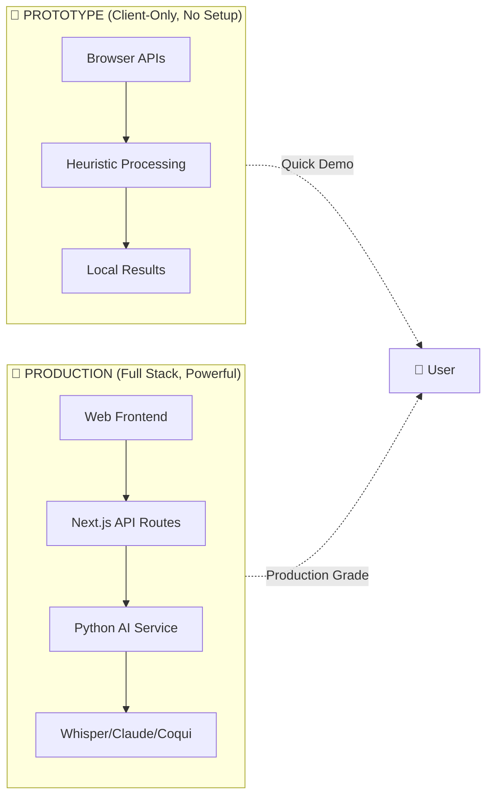
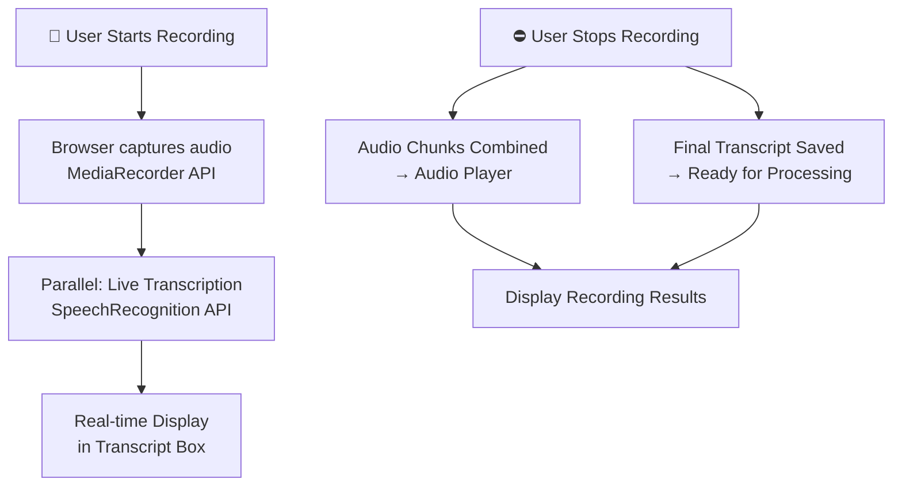

# 🎓 Fren-Edu Architecture & Flow Diagrams

## 📊 Quick Overview



---

## 🎙️ Recording & Transcription



---

## 🧠 Summarization Pipeline

### 🎯 Prototype: Heuristic (No AI)
```
Transcript
  ↓
Split into sentences
  ↓
Rank by TF (Term Frequency)
  ↓
Pick Top 3 Sentences → Summary
Pick Top 6 Keywords → Key Points
  ↓
Display in UI (instant)
```

### 🚀 Production: Claude AI
```
Transcript
  ↓
POST /api/summarize
  ↓
Next.js Route → FastAPI
  ↓
Anthropic Claude API
  ↓
Generate:
  - Title
  - Summary (3 paragraphs)
  - 5-10 Key Points
  - Mind Map
  - Definitions
  ↓
Display in UI (2-5 seconds)
```

---

## ❓ Q&A System

### 🎯 Prototype: Keyword Matching
```
User Question + Transcript
  ↓
Extract keywords from question
  ↓
Find best matching sentence
  (highest keyword overlap)
  ↓
Display Sentence → Answer
```

### 🚀 Production: Claude Evaluation
```
User Question + Correct Answer + User Input
  ↓
Claude Evaluates:
  - Semantic similarity
  - Score 0-100
  - Generate feedback
  ↓
Display Score + Suggestions
```

---

## 🔊 Text-to-Speech (TTS)

### 🎯 Prototype: Browser Native
```
Summary + Voice Selection + Speed
  ↓
SpeechSynthesis API
  ↓
Browser-native TTS
  ↓
Output to Speaker (instant)
```

### 🚀 Production: Coqui TTS
```
Summary + Voice Style + Speed
  ↓
POST /api/tts
  ↓
Coqui TTS Model (xtts_v2)
  ↓
Generate Audio File
  ↓
Save to Supabase
  ↓
Return URL → Play in UI
```

---

## 🔄 Complete Session Flow

### Prototype (Single Page, Instant)
```
1. Record → Transkrip (Live)
2. Ringkas → Summary + Key Points (0.5s)
3. Ask Q&A → Keyword Match (instant)
4. Dengarkan → TTS (instant)
5. Refresh → Everything lost
```

### Production (Multi-page, Saved)
```
1. Login (NextAuth.js)
2. New Recording
   → Start chunked recording
   → Upload to Supabase real-time
3. Stop Recording
   → Orchestrate AI pipeline
   → Whisper (1-2 min)
   → Claude Summary (5-10 sec)
   → Save to Database
4. View Results
   → Full Transcript
   → AI Summary
   → Key Points
   → Mind Map
5. Q&A Mode
   → Generate Questions (Claude)
   → Evaluate Answers (Claude)
   → Track Progress
6. TTS Customization
   → Generate audio (Coqui)
   → Choose voice style
   → Listen & download
7. Session Permanently Saved
   → Access anytime
   → History tracking
```

---

## 🎯 Key Differences at a Glance

| Feature | Prototype | Production |
|---------|-----------|------------|
| **Setup** | None! Just open HTML | Docker + API keys |
| **STT** | Browser SpeechRecognition | Whisper (OpenAI) |
| **Summarization** | Heuristic | Claude (AI) |
| **Q&A** | Keyword matching | Claude (AI) |
| **TTS** | SpeechSynthesis | Coqui TTS |
| **Storage** | Temp (RAM) | Persistent (Cloud) |
| **Database** | None | PostgreSQL + Supabase |
| **Quality** | 70% | 99% |
| **Cost** | $0 | Pay per API call |

---

Made for students who want to learn smarter. 🎓
